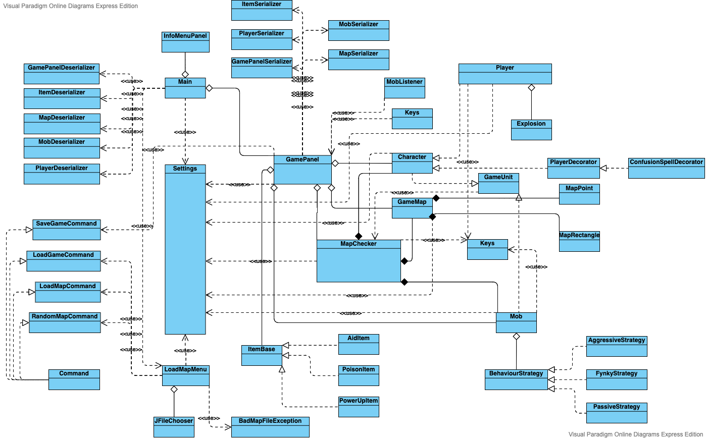

# roguelike 
roguelike game on kotlin

### Архитектурное описание

При старте игры игроку предлагается загрузить карту из файла, либо играть на случайно сгенерированной карте. 

За это отвечает класс `LoadMapMenu`, который для загрузки карты из файла использует `JFileChooser` из библиотеки `Swing`.  

Kласс `Map` отвечает за карту. Он состоит из точек класса `MapPoint`

`GamePanel` - главное окно взаимодействия. В этом классе написана логика отрисовки персонажа и взаимодейтсвие с клавиатурой.
При нажатии кнопок *WASD* у персонажа обновляются координаты и при ререндиренге он отрисовывается уже в другом месте.

