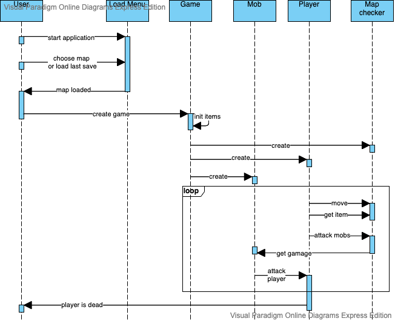

# roguelike 

roguelike game on kotlin

#### Общие сведения о системе
Система представляет собой игру, где главная цель игрока - выживать, убивая мобов, повышая тем самым свой уровень.
На карте игрок может найти предметы, которые можно либо использовать, либо надеть. Также предметы можно выбрасывать.
Мобов бывает 3 вида: агрессивные, пассивные и трусливые, при нахождении в непосредственной близости с игроком они
атакуют, нанося ему урон. Игрок может атаковать мобов, находящихся рядом с ним.

#### Architectural drivers:
Технические ограничения: 
 - персональный компьютер
 - реал-тайм
 - тайловая графика
 - однопользовательская
 - расширяемость
 
Программные ограничения:
- операционная система Mac Os, Windows, Linux
- для запуска игры должна быть установлена JDK версии выше 1.8

#### Роли и случаи использования:
Администратор:
 - Предустанавливает JVM и игру на компьютер.

Игрок:
 - Открывает игру, выбирает вариант загрузки игры: 
со случайной картой, с картой из файла или с последнего созранения (в случае его присутствия).

### Архитектурное описание
При старте игры игроку предлагается загрузить карту из файла, либо играть на случайно сгенерированной карте. За это
отвечает класс `LoadMapMenu`, который для загрузки карты из файла использует `JFileChooser` из библиотеки `Swing`.
Kласс `Map` отвечает за карту. Он состоит из точек класса `MapPoint`.

`GamePanel` - главное окно взаимодействия. В этом классе написана логика отрисовки персонажа и взаимодействие с клавиатурой.
При нажатии кнопок *WASD* у персонажа обновляются координаты и при ререндеринге он отрисовывается уже в другом месте.

За игрока отвечает интерфейс `Character`, от которого есть базовая реализация игрока `Player`, а есть абстрактный класс
декоратора `PlayerDecorator`, имплементация которого (`ConfusionSpellDecorator`) отвечает за заклинание конфузии, которое
временно накладывается на игрока при перемещении на соответствующую клетку карты.

Мобы(класс `Mob`), как и персонаж, реализуют интерфейс `GameUnit` для движения по карте. При нахождении в радиусе атаки
игрок клавишей `ENTER` может атаковать мобов, а они будут атаковать его. Есть три вида мобов по поведению, это
реализовано с помощью паттерна стратегия посредством абстрактного класса `BehaviourStrategy`, три имплементации которого
соответствуют трем разным поведениям.

Для проверки возможности движения по карте существует класс `MapChecker`, в котором есть функции проверки возможности
движения. Для возможности сохранения и запуска игры используется сериализация и десериализация, для которых есть адаптеры,
позволяющие менять логику сериализации и десериализации. Классы-адаптеры находятся в пакете com.roguelike.saving и
реализованы для `Character`, `Mob`, `GameMap`, `ItemBase`, `GamePanel`. Чтобы сохранить игру, нажмите `T`.

За информационную панель отвечает класс `InfoMenuPanel`, в котором отображается уровень, количество здоровья и опыта,
предметы из инвентаря.

За предметы отвечает абстрактный класс `ItemBase`, имплементации которого `AidItem`, `PoisonItem` и `PowerUpItem`
соответствуют трем различным предметам, которые можно найти и подобрать на карте. Для использования предмета нажмите `E`,
чтобы выбросить предмет, нажмите `F`. Надевание вещей происходит так же по клавише
 `E`. Чтобы переключаться по предметам, используйте `Q`, для доступа к нужному предмету,
нажмите клавишу `1..8`, соответствующую нужному предмету.

#### Диаграмма классов

#### Диаграмма компонентов

Основные компоненты:
`Подсистема инициализации`: в ней происходит инициализация игры. В ней инициализируются `подсистема отображения`,
`главное игровое поле`, `поле игровой информации`. Для того, чтобы она смогла проинициализировать главное игровое окно,
используется подсистема инициализации карты. После того, как игра проинициализирована, логика сконцентрирована
в `главном игровом поле`, которое отвечает за игровую карту, игровые объекты и их состояние, взаимодействие 
с пользователем, и в `поле игровой иноформации`, которое отвечает за отображение пользователю текущего состояния: 
уровня здоровья, опыта, уровня, предметов инвентаря. За отрисовку на экране обоих этих полей отвечает `подсистема
отображения`.

#### Диаграмма состояния моба и диаграмма активностей

В зависимости от расстояния до игрока мобы ведут себя по-разному.
Агрессивный моб, в случае, если игрок оказывается на расстоянии, достаточной для погони -
пытается сократить расстояние между собой и игроком. Пасивный в этом случае стоит на месте, а трусливый - наоборот, убегает.
При этом, если игрок оказывается на расстоянии, достаточном для атаки, 
то моб начинает атаковать игрока до тех пор, пока это расстояние не увеличится, либо пока игрок не погибнет.

На нижней диаграмме находится жизненный цикл игры.
Перед старком игры нужно инициализировать игровое поле. Инициализация игрового поля зависит от того, какой вариант выбран на экране загрузки.
Если здоровье игрока становится равным нулю, то он погибает, и игра заканчивается.

#### Диаграмма последовательностей 

Пользователь запускает приложение, создается загрузочное меню, 
которое предлагает пользователю способ загрузки игры.
Когда карта игры загружена, создается игровое поле, которое инициализирует предметы на карте, создает мобов, игрока и чекер.
Далее запускается игровой цикл, в котором игрок может двигаться по карте, атаковать мобов и получать предметы с карты.
При атаке мобов они получают урон. Мобы так же могут атаковать игрока и, в случае нехватки здоровья у игрока, он погибает и игковой цикл заканчивается.

&nbsp;
#### Игровой процесс:

